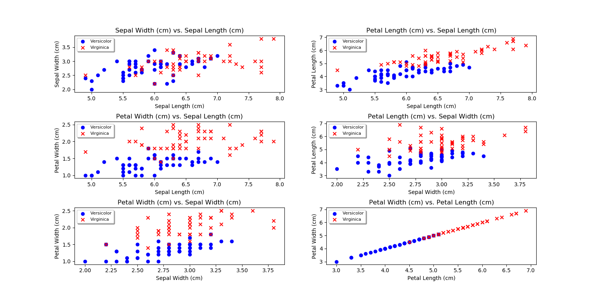

# Fisher's Linear Discriminant Analysis on the Iris Dataset By Shandy Sulen

## Feature Relationships

In addition to Fisher’s Linear Discriminant Analysis (shown later) are 2D scatterplots that present the relationships between the features of the Setosa, Versicolor, and Virginica classes before the patterns are fit to a model.

<em>Figure 1: Setosa & Versicolor Features 2D Scatterplot</em>

<em>Figure 2: Setosa & Virginica Features 2D Scatterplot</em>

<em>Figure 3: Versicolor & Virginica Features 2D Scatterplot</em>

## Results

By finding the generalized eigenvalue/eigenvector problem for each pair of classes, I solved for the leading eigenvector with the greatest eigenvalue to use as w, which projected the initial data patterns onto 1-dimensional space. Figure 4 below shows the training examples of the three classes projected into one-dimensional space where the distance between the class centroids is maximized and the spread or variance within the class is minimized as per the objective function.

.png)

<em>Figure 4: LDA 1D Scatterplots (Histograms)</em>

### Setosa & Versicolor Threshold 

In the leftmost histogram, the maximum Setosa pattern value is approximately 1.58, and the minimum Versicolor pattern value is approximately 1.72. Thus, any threshold value ranging from (1.58, 1.72) will yield zero misclassification errors and successfully discriminate against all Setosa and Versicolor training patterns. One might pick the midpoint of this range as the final threshold value, which would be 1.65.

.png)

<em>Figure 5: Setosa & Versicolor Histogram (Threshold Value=1.65, Misclassification Errors=0)</em>

### Setosa & Virginica Threshold

Similar to the relationship between the Setosa & Versicolor classes shown in Figure 5, the Setosa & Virginica classes are also linearly separable, i.e. a threshold can be picked that minimizes the misclassification error number to zero. The same heuristic is utilized in this case as it was in Figure 5. The minimum Setosa class value is -1.09, and the maximum Virginica class value is -4.86. Thus, any value within the range (-1.09, -4.86) may be selected as the threshold, or decision boundary, that discriminates Setosa training patterns against Virginica training patterns with zero misclassification errors. One might pick the midpoint value within this range, -2.98, as the threshold value of -2.98, which is shown below.

.png)

<em>Figure 6: Setosa & Virginica Histogram (Threshold Value=-2.98, Misclassification Errors=0)</em>

### Versicolor & Virginica Threshold

The classes of Versicolor and Virginica are not linearly separable, i.e. a decision boundary on the projected 1D line can’t guarantee a misclassification error rate of zero, even when using only training patterns. Therefore, to decide on the decision boundary that minimizes the misclassification error, I created a straightforward O(N2) algorithm within my code called find_threshold()to test out positions in between each value as a potential threshold. The output includes the position that minimizes misclassification errors along with the number of misclassification errors the position holds. Using this Python function, I ascertained that one of the best possible threshold values is approximately 1.76 with a total misclassification error number of 25.

.png)

<em>Figure 7: Versicolor & Virginica Histogram (Threshold Value=~1.76, Misclassification Errors=25)</em>
